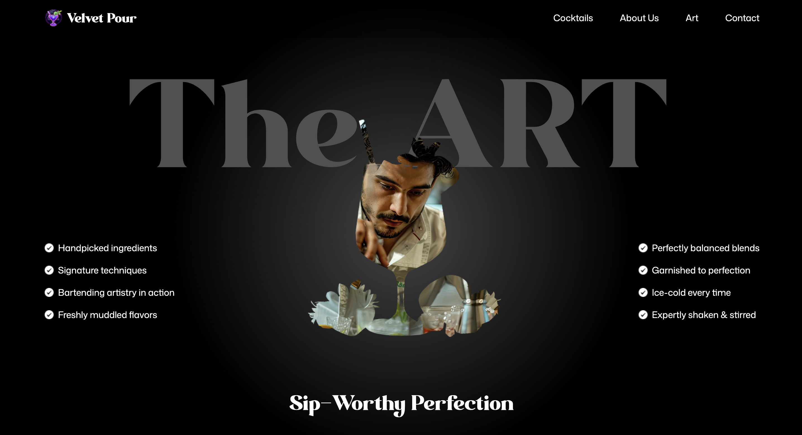

# Mojito Cocktail Website Clone

This project is a clone of a visually appealing, animated website for a cocktail bar, focusing on mojitos. It was built to showcase modern web development techniques, including the use of GSAP for animations.

## Demo Link

[live demo](https://mojito-cocktail-clone-codex047.netlify.app/)

## Tech Stack

- **[Vite](https://vitejs.dev/)** - Next Generation Frontend Tooling
- **[React](https://reactjs.org/)** - A JavaScript library for building user interfaces
- **[Tailwind CSS](https://tailwindcss.com/)** - A utility-first CSS framework
- **[GSAP (GreenSock Animation Platform)](https://greensock.com/gsap/)** - A professional-grade animation library for the modern web

## Installation

To get a local copy up and running, follow these simple steps.

1.  **Clone the repo**
    ```sh
    git clone https://github.com/CodeX047/MojitoClone
    ```
2.  **Install NPM packages**
    ```sh
    npm install
    ```
3.  **Run the development server**
    ```sh
    npm run dev
    ```

## Features

-   **Hero Section:** A stunning hero section with animated text and a video background that plays on scroll.
-   **Engaging Sections:** Dedicated sections for Cocktails, About, The Art of the Cocktail, Menu, and Contact information.
-   **Advanced Animations:** Smooth, scroll-triggered animations powered by GSAP, including parallax effects, text reveals, and image masks.
-   **Interactive Menu:** An interactive cocktail menu that allows users to browse through different recipes.
-   **Responsive Design:** A fully responsive layout that looks great on all devices.

## Usage / Example Code

The animations in this project are powered by GSAP. Here is an example of how the `useGSAP` hook is used to create a scroll-triggered animation for the "About" section:

```jsx
import gsap from "gsap"
import { useGSAP } from "@gsap/react"
import { SplitText } from "gsap/all"

const About = () => {
  useGSAP(() => {
    const titleSplit = SplitText.create('#about h2', { types: 'words' })
  
    const ScrollTimeline = gsap.timeline({
      scrollTrigger: {
        trigger: '#about',
        start: 'top center',
      }
    })   

    ScrollTimeline
      .from(titleSplit.words, {
        opacity: 0,
        duration: 1,
        yPercent: 100,
        ease: "expo.out",
        stagger: 0.02,
      })
      .from('.top-grid div, .bottom.grid div', {
        opacity: 0,
        duration: 1,
        ease: 'power1.inOut',
        stagger: 0.04,
      }, '-=0.5')
  }, []) 

  // ... rest of the components
}
```

## Project Structure

```
/
├───.gitignore
├───eslint.config.js
├───index.html
├───package-lock.json
├───package.json
├───README.md
├───vite.config.js
├───constants/
│   └───index.js
├───public/
│   ├───fonts/
│   ├───images/
│   └───videos/
└───src/
    ├───App.jsx
    ├───index.css
    ├───main.jsx
    └───components/
        ├───About.jsx
        ├───Art.jsx
        ├───Cocktails.jsx
        ├───Contact.jsx
        ├───Hero.jsx
        ├───Menu.jsx
        └───Navbar.jsx
```

## Troubleshooting

-   **Installation issues:** If you encounter issues with `npm install`, try deleting your `node_modules` folder and `package-lock.json` file, and then run `npm install` again.
-   **Animation issues:** Ensure that your browser has JavaScript enabled. If animations are still not working, check the browser's console for any GSAP-related errors.

## Screenshots




## Badges

[](https://reactjs.org/)
[](https://vitejs.dev/)
[](https://tailwindcss.com/)
[](https://greensock.com/gsap/)

## Acknowledgments

-   This project was inspired by an online design.
-   Thanks to the creators of the libraries and tools used in this project.